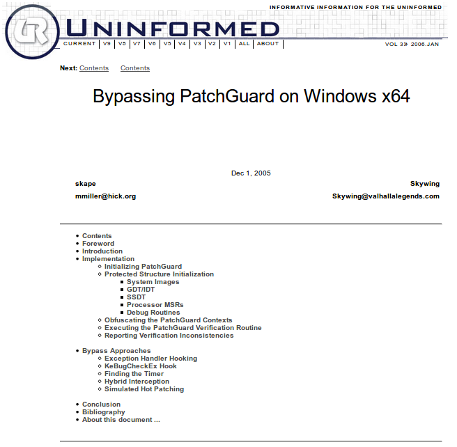
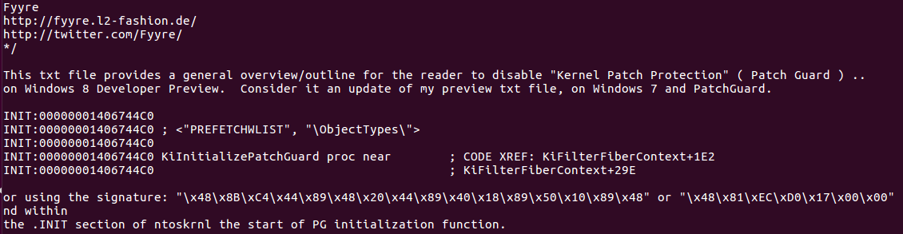
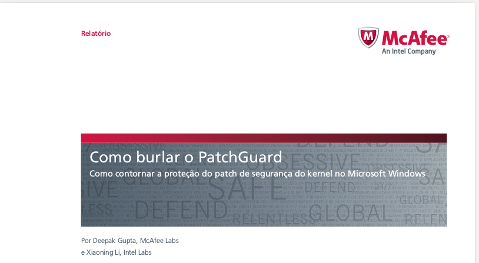
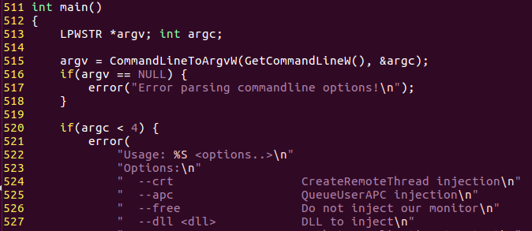
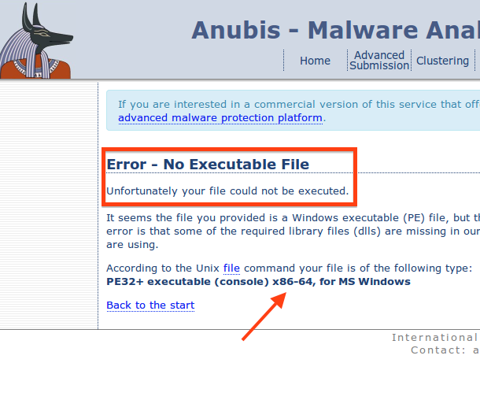
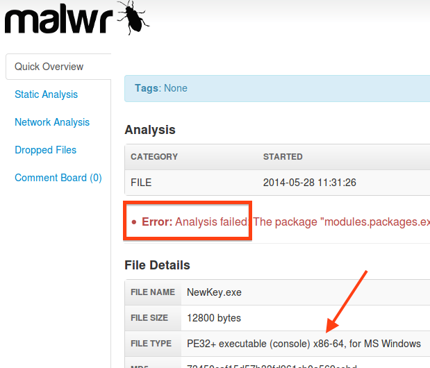

# BehEMOT.Paper

Additional information for the "The Other Guys" paper, in which I discuss the challenges of monitoring x64 Windows OSes. When I started this project (2012), Windows was transitioning from x32 to x64 systems and introducing significative changes, such as KPP. In this repo, I present extra information not added to the paper, such as KPP bypasses, AV practices. I also show how sandboxes of that time used to fail to analyze PE+ binaries. Since then, our developed solution (BehEMOT) has evolved and was deployed as an online sandbox.

## Availability

* The paper is available [here](https://secret.inf.ufpr.br/papers/behemot.pdf)
* The sandbox is deployed [here](https://corvus.inf.ufpr.br/)

## Kernel Patch Protection (KPP)

We pointed on the paper which the Kernel Patch Protection (KPP) denies changing kernel structures, thus prohibiting kernel hooks used for monitoring, such as SSDT hooking. However, some tried to overcome such limitation by disabling the kernel protection. 

We presented links for such exploits and patches on the paper. However, as some of them were withdrawn and others are hosted on frequently unavailable services, I decided to present here a (very brief) recap.



The *Uninformed* site presented exploits for distinct KPP versions, from Windows Vista to Windows 8.



The first version of W8 was exploited by the same tricks used on previous versions of PatchGuard.



The company *McAfee* also exploited KPP implementation to provide monitoring features for their security solutions.

However, as we aimed portability when developing the solution, we didn't make use of any of these exploits. We used kernel callbacks instead.

If you are interested on discussing the role of such exploits, get in contact!

## DLL Injection

In the paper we discuss the impact of *session isolation* on the *DLL Injection* procedure. We pointed which some solutions, such [Cuckoo Sandbox](https://github.com/cuckoosandbox/monitor) solved this problem by using *QueueUserAPC* insted of *CreateRemoteThread*, as can be seen on the figure below:



### Proving the point

One limitation of using *CreateRemotTherad* would be analyzing code which runs on a different session. This way, installing the malware as a service, for example, would evade the analysis procedure. You can check such fact by compling a [Simple Service](https://code.msdn.microsoft.com/windowsapps/CppWindowsService-cacf4948) and trying to analyze it. 

Remember you should add the code to be monitored, as shown below:

```
void CSampleService::ServiceWorkerThread(void)
{
    // Periodically check if the service is stopping.
    while (!m_fStopping)
    {
        // Perform main service function here...

        OutputDebugStringA("Try to monitor this!");
        ::Sleep(2000);  // Simulate some lengthy operations.
    }
```

## 64-bit samples

64-bit samples are not as frequently found as 32-bit ones, so I present here some hashes so you can check them on the internet.

The following samples were captured on the wild:

* 46db4791c35d6c83862e2712cf411c3f
* 5d794de4389c40ff08a66c0e6cf2163d
* ca82853fd71df06831edf7ffede4b1d5
* fb7a765c02c06123958c20512c1b8e6a
* fb7a765c02c06123958c20512c1b8e6a
* 860faca3f8187b966b9507eee66af55b
* 0f396ec1f78f358156fa8a62549a1dfb
* 8ae9af42f7d7600bb71eff77409a887f
* 39b447e293979ac7259d4d9a2711c9a0
* 942c61920d2482b6c5d2e2193aac82f6
* 7d1bed5490a142a0bcc35a2ac2d19e2c
* b6335f2bae2a8baa523667ca4694e601
* 47719e351beb5007e7d18af321b71e9d
* cc793e5b0df621b8d572cf4e7f26e053

The samples on the [64bit.samples.txt](https://github.com/marcusbotacin/BehEMOT.Paper/blob/master/64bit.samples.txt) were retrieved from [Virus Share](http://virusshare.com/).

## Differences between Win7 and Win8

At time analysis were performed, Windows 8 was claimed to be the most secure Windows ever. Previously, Windows 7 was also claimed so.
As we demonstrated on the [first paper](http://www.lbd.dcc.ufmg.br/colecoes/sbseg/2014/0015.pdf), old Windows XP threats were still able to infect both newer systems. However, in fact, Windows 8 evolved from Windows 7, what can be seen on the following experiment:

The data below refers to the experiments conduct in the scope of [1001 Nights paper](https://github.com/marcusbotacin/1001-Nights). The *Run* key written on W7 are the following:

```
('\\REGISTRY\\USER\\S-1-5-21-603313242-1591760659-684491057-1000\\Software\\Microsoft\\Windows\\CurrentVersion\\Run', 16218)
('\\REGISTRY\\MACHINE\\SOFTWARE\\Wow6432Node\\Microsoft\\Windows\\CurrentVersion\\RunOnce', 8589)
('\\REGISTRY\\USER\\S-1-5-21-603313242-1591760659-684491057-1000\\Software\\Microsoft\\Windows\\CurrentVersion\\RunOnce', 8560)
('\\REGISTRY\\MACHINE\\SOFTWARE\\Wow6432Node\\Microsoft\\Windows\\CurrentVersion\\Run', 4598)
('\\REGISTRY\\MACHINE\\SOFTWARE\\MICROSOFT\\Windows\\CurrentVersion\\RunOnce', 94)
('\\REGISTRY\\USER\\S-1-5-21-603313242-1591760659-684491057-1000\\Software\\Microsoft\\Windows\\CurrentVersion\\Policies\\Explorer\\Run', 56)
('\\REGISTRY\\MACHINE\\SOFTWARE\\MICROSOFT\\Windows\\CurrentVersion\\Policies\\Explorer\\Run', 27)
('\\REGISTRY\\MACHINE\\SOFTWARE\\Wow6432Node\\Microsoft\\Tracing\\RunLegacyCPLElevated_RASMANCS', 18)
('\\REGISTRY\\MACHINE\\SOFTWARE\\Wow6432Node\\Microsoft\\Tracing\\RunLegacyCPLElevated_RASAPI32', 18)
('\\REGISTRY\\MACHINE\\SOFTWARE\\Microsoft\\Windows\\CurrentVersion\\Policies\\Explorer\\Run', 9)
('\\REGISTRY\\MACHINE\\SOFTWARE\\Wow6432Node\\Microsoft\\Tracing\\JavaRuntime_RASAPI32', 6)
('\\REGISTRY\\MACHINE\\SOFTWARE\\Wow6432Node\\Microsoft\\Tracing\\JavaRuntime_RASMANCS', 6)
('\\REGISTRY\\MACHINE\\SOFTWARE\\Wow6432Node\\Microsoft\\Tracing\\Runner_RASAPI32', 6)
('\\REGISTRY\\MACHINE\\SOFTWARE\\Wow6432Node\\Microsoft\\Tracing\\Runner_RASMANCS', 6)
('\\REGISTRY\\MACHINE\\SOFTWARE\\MICROSOFT\\Windows\\CurrentVersion\\Run', 6)
('\\REGISTRY\\MACHINE\\SYSTEM\\ControlSet001\\services\\eventlog\\Application\\VBRuntime', 4)
('\\REGISTRY\\MACHINE\\SOFTWARE\\MICROSOFT\\WINDOWS NT\\CURRENTVERSION\\Image File Execution Options\\aswRunDll.exe', 2)
('\\REGISTRY\\MACHINE\\SOFTWARE\\Wow6432Node\\Microsoft\\Windows\\CurrentVersion\\Run /v svchost.exe /t reg_sz /dC:\\Users\\Win7\\svchost.exe', 1)
('\\REGISTRY\\MACHINE\\SYSTEM\\ControlSet001\\services\\Run', 1)
('\\REGISTRY\\USER\\S-1-5-21-603313242-1591760659-684491057-1000\\Software\\Microsoft\\Windows\\CurrentVersion\\Policies\\Explorer\\DisallowRun', 1)
('\\REGISTRY\\USER\\S-1-5-21-603313242-1591760659-684491057-1000\\Software\\Microsoft\\Windows NT\\CurrentVersion\\Windows\\Run', 1)
('\\REGISTRY\\USER\\S-1-5-21-603313242-1591760659-684491057-1000\\System\\CurrentControlSet\\Services\\Run', 1)
```

The *Run* keys written on W8 are the following:

```
('\\REGISTRY\\USER\\S-1-5-21-3760592576-961097288-785014024-1001\\Software\\Microsoft\\Windows\\CurrentVersion\\RunOnce', 5859)
('\\REGISTRY\\USER\\S-1-5-21-3760592576-961097288-785014024-1001\\Software\\Microsoft\\Windows\\CurrentVersion\\Run', 2455)
('\\REGISTRY\\MACHINE\\SOFTWARE\\Wow6432Node\\Microsoft\\Windows\\CurrentVersion\\Run', 408)
('\\REGISTRY\\MACHINE\\SOFTWARE\\Wow6432Node\\Microsoft\\Windows\\CurrentVersion\\RunOnce', 83)
('\\REGISTRY\\USER\\S-1-5-21-3760592576-961097288-785014024-1001\\Software\\Microsoft\\Windows\\CurrentVersion\\Policies\\Explorer\\Run', 3)
('\\REGISTRY\\MACHINE\\SOFTWARE\\MICROSOFT\\Windows\\CurrentVersion\\Run', 2)
('\\REGISTRY\\USER\\S-1-5-21-3760592576-961097288-785014024-1001\\Software\\Microsoft\\Windows NT\\CurrentVersion\\Windows\\Run', 1)
```

As can be seen, fewer keys were written on Windows 8.

## Other sandboxes

We mentioned on the paper a comparison with other sandbox solutions. As the *Anubis* project was finished and the *Malwr* is being updated, I decided to present here the screenshots which support our claims.




